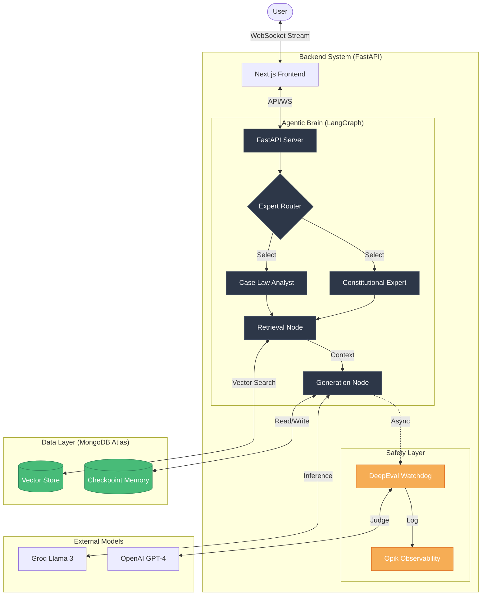

# Ghana Legal AI - Technical Architecture 🏗️🇬🇭

## 1. System Overview
Ghana Legal AI is a **Retrieval-Augmented Generation (RAG)** application designed to provide expert legal assistance on Ghanaian law. It employs an **Agentic Workflow** to simulate different legal personas (Constitutional Lawyer, Case Law Analyst, Legal Historian), ensuring responses are accurate, context-aware, and steeped in the specific legal domain.

### System Architecture Diagram

## 2. Architecture Stack

### **Frontend (Presentation Layer)**
- **Framework**: [Next.js 14](https://nextjs.org/) (App Router)
- **Language**: TypeScript
- **Styling**: Tailwind CSS (Custom "Legal Gold/Green" theme)
- **State Management**: React Hooks (Stream handling)
- **Communication**: WebSockets (`useWebSocket`) for real-time token streaming.

### **Backend (Logic Layer)**
- **Framework**: [FastAPI](https://fastapi.tiangolo.com/) (Python 3.10+)
- **Orchestration**: [LangGraph](https://langchain-ai.github.io/langgraph/) (Stateful Multi-Actor Applications)
- **LLM Integration**: [LangChain](https://www.langchain.com/)

### **Data & Storage (Persistence Layer)**
- **Database**: [MongoDB Atlas](https://www.mongodb.com/atlas)
- **Vector Search**: MongoDB Atlas Vector Search (Hierarchical Navigable Small World - HNSW)
- **Conversation Memory**: MongoDB-backed Checkpointers (`MongoDBSaver`)

### **Observability & Evaluation**
- **LLM Tracing**: [Opik](https://www.comet.com/site/products/opik/) (powered by Comet)
- **Evaluation**: [DeepEval](https://confident-ai.com/) (Real-time metric calculation)

---

## 3. Core Components Deep Dive

### A. The Agentic Brain (LangGraph)
Unlike simple chatbots that use a linear chain (`Prompt -> LLM -> Output`), this system uses a **State Graph**.

1.  **State Schema**: The conversation state tracks:
    *   `messages`: List of chat history.
    *   `legal_context`: Retrieved documents.
    *   `expert_profile`: Current active persona (e.g., "Constitutional Expert").
    *   `style`: Output format rules.

2.  **The Graph Flow**:
    *   **Start**: User Query.
    *   **Retrieval Node**: Vector search in MongoDB for relevant laws/cases.
    *   **Conversation Node**: LLM generates response using retrieved context + Persona Prompts.
    *   **End**: Stream tokens to user.

### B. RAG Pipeline (Retrieval-Augmented Generation)
1.  **Ingestion**:
    *   **Loader**: `PyPDFLoader` reads legal PDFs (e.g., 1992 Constitution).
    *   **Chunking**: `RecursiveCharacterTextSplitter` breaks text into manageble chunks (1000 chars).
    *   **Embedding**: `sentence-transformers/all-MiniLM-L6-v2` converts text to 384-dimensional vectors.
    *   **Storage**: Vectors stored in `legal_docs` collection in MongoDB.

2.  **Retrieval**:
    *   User query is embedded into a vector.
    *   **Atlas Vector Search** finds the nearest K neighbors (most similar legal text).
    *   Top results are injected into the System Prompt.

### C. Real-Time Evaluation Pipeline
We don't just generate answers; we **grade** them instantly.

1.  **Async Execution**:
    *   After the main response stream finishes, a background task (`asyncio.create_task`) starts the evaluator.
    *   This ensures the user experiences **zero latency** penalty for evaluation.

2.  **Metrics (DeepEval)**:
    *   **Faithfulness**: Does the answer hallucinate? (Checks if answer is supported by retrieved context).
    *   **Answer Relevancy**: Does the answer actually address the user's prompt?
    *   **Hallucination**: Specific check for fabricated facts.

3.  **Logging**:
    *   Scores are sent to **Opik**.
    *   **Standalone Traces**: Evaluations appear as distinct traces tagged with `evaluation-realtime`, providing a clear "Scorecard" for every interaction.

---

## 4. Key Technical Decisions

### Why MongoDB Atlas?
We needed a unified solution. Instead of using Postgres for app data + Pinecone for vectors + Redis for memory, MongoDB Atlas handles:
*   **Vector Store**: Storing embeddings.
*   **Chat History**: Storing LangGraph checkpoints (`checkpoints` collection).
*   **App Data**: Storing user profiles (future-proof).

### Why LangGraph over LangChain Chains?
Legal conversations are complex. LangGraph allows **Cycles** and **Persistence**:
*   If we need to ask a clarifying question, the graph can "loop back".
*   If the server restarts, the `MongoDBSaver` restores the exact conversation state from the database.

### Why Lazy Imports?
To avoid **Circular Dependencies** (a common Python trap). The Evaluation service needs the Conversation service to run simulated queries, but the Conversation service needs the Evaluator to log results. We solved this by importing the Evaluator *inside* the function call, breaking the initialization cycle.

---

## 5. Deployment Topology
*   **Frontend**: Edge-optimized (Vercel).
*   **Backend**: Containerized Python workers (Render/Railway).
*   **DB**: Managed Cloud Cluster (AWS/GCP via Atlas).
