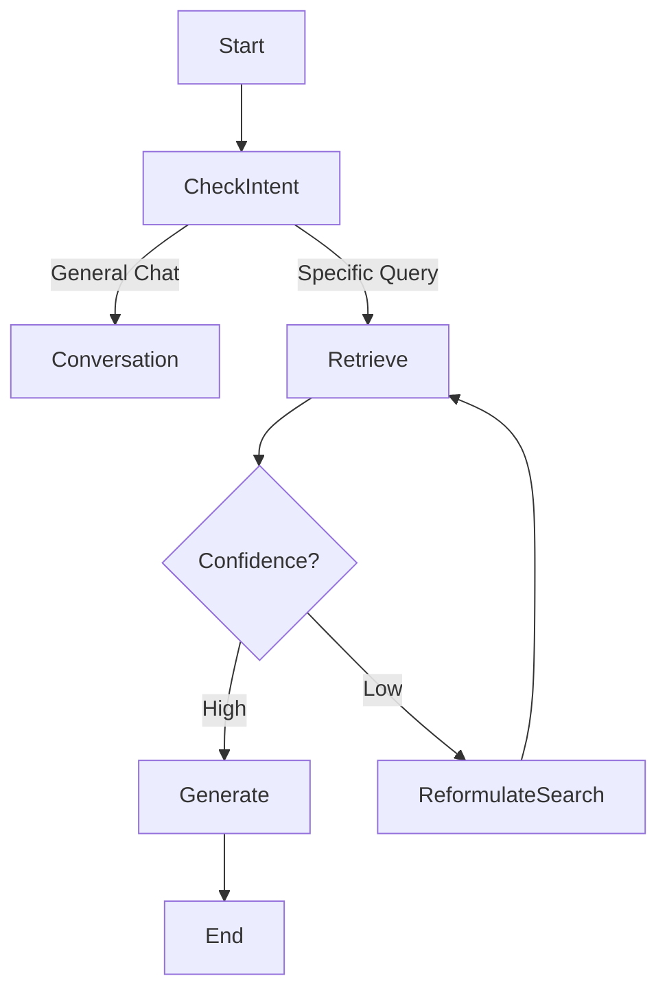

# Building Sovereign Legal AI: A Masterclass in Production LLM Systems

*How we engineered a sovereign, fine-tuned legal agent for Ghana using Knowledge Distillation, hybrid RAG, and deterministic orchestration.*

---

## The Thesis: Beyond Wrappers 🧠

Most "AI apps" today are thin wrappers around API endpoints. They suffer from three fatal flaws for specialized domains like Law:
1.  **Hallucination**: Generic models invent citations.
2.  **Latency**: Cloud round-trips destroy the "conversational" feel.
3.  **Data Sovereignty**: Sensitive legal queries shouldn't leave the jurisdiction.

**Ghana Legal AI** is an architectural answer to these problems. It is not just a chatbot; it is a **Sovereign AI System**. We combined **Knowledge Distillation** (teaching a small model) with **Graph-based Orchestration** (controlling the model) to build an assistant that runs locally, reasons accurately, and scales infinitely.

Here is the deep-dive engineering breakdown of how we built it.

---

## Module 1: The "Teacher-Student" Distillation Pipeline 🧪

The cornerstone of this project isn't the model itself—it's the *data factory*. We didn't want a generic assistant; we wanted a Ghanaian Legal Scholar.

### The Problem
Generic models (GPT-4, Llama 3) know *about* Ghana law, but they don't *think* like a Ghanaian lawyer. They lack the specific phrasing, citation style, and localized context of the Second Republic or 1992 Constitution.

### The Logic: Synthetic Data Generation
We employed **Knowledge Distillation**. We used a massive "Teacher" model (Llama 3 70B) to read raw PDFs and generate high-quality "Student" examples.

1.  **Ingestion**: We scraped 46 seminal Supreme Court judgments from `ghalii.org`.
2.  **Extraction**: Raw text is messy. We built a custom parser to strip header/footers and identify case holdings.
3.  **Generation**: We prompted the "Teacher" to act as a Senior Judge and generate 524 structured Q&A pairs.

**Senior Insight**: Synthetic data is the "nuclear fuel" of modern AI. By controlling the *prompt* to the teacher, we controlled the *behavior* of the student. We forced the teacher to output "ShareGPT" format, ensuring our dataset was ready for training immediately.

```python
# The "Teacher" Prompt Strategy
system_prompt = """
You are a Senior Judge of the Supreme Court of Ghana.
Read the provided legal text.
Generate 5 distinct Q&A pairs that test:
1. Factual Recall ("What was the holding?")
2. Legal Reasoning ("Why did the court distinguish this precedent?")
3. Constitutional Interpretation ("How does Article 12 apply?")
"""
```

---

## Module 2: Efficient Fine-Tuning with LoRA ⚡

We chose **LFM2-1.2B** (Liquid Foundation Model) as our base. Why? Because 1.2B parameters is the "Goldilocks" size for edge deployment—small enough to run on a standard laptop, smart enough to learn a specific domain.

### The Stack
*   **Framework**: Unsloth (for 2x faster training).
*   **Technique**: QLoRA (Quantized Low-Rank Adaptation).
*   **Hardware**: Single T4 GPU (Google Colab Free Tier).

We didn't retrain the whole model (which is slow and destructive). We injected **trainable rank-decomposition matrices** into the attention layers. This allowed us to update just 1% of the weights while freezing the pretrained 99%.

### The Result
*   **Training Time**: ~15 minutes.
*   **Dataset**: 524 high-quality legal pairs.
*   **Outcome**: A model that intuitively understands citations like *"As held in Tuffuor v Attorney General..."* without needing them in the context window.

---

## Module 3: Deterministic Orchestration with LangGraph 🕸️

A fine-tuned model is just a brain. It needs a body to act. We rejected standard "chains" (linear steps) in favor of a **State Machine** using LangGraph.

### Why Graphs?
Legal research is non-linear. You search, read, realize you need more info, search again, then synthesize. A linear chain cannot do this. A graph can.



### The Code Pattern
We defined our flow as a sequence of typed nodes. Notice the **conditional edge**:

```python
# src/ghana_legal/workflow/graph.py

workflow = StateGraph(LegalExpertState)

# Define the precise "Actions" our agent can take
workflow.add_node("retrieve_docs", retrieve_legal_documents)
workflow.add_node("generate_answer", generate_legal_advice)

# The "Reasoning" Engine
workflow.add_edge(START, "retrieve_docs")
workflow.add_conditional_edges(
    "retrieve_docs",
    should_we_search_again, # <- The Decision Function
    {
        "yes": "retrieve_docs",
        "no": "generate_answer"
    }
)
```

**Senior Insight**: This is "Flow Engineering." By explicitly defining the *states* and *transitions*, we eliminate the unpredictability of "letting the LLM decide everything." We constrain the specialized intelligence into a reliable process.

---

## Module 4: The Hybrid "Cloud-to-Edge" Architecture 🌩️💻

We built for reality, not just demos. In the real world, internet cuts out, APIs go down, and costs scale linearly with users.

### The Hybrid Switch
Our architecture supports dynamic switching between **Groq (Cloud)** and **Ollama (Local)**.

1.  **Groq (Llama 3 70B)**: Used for *complex* multi-step reasoning or summarization tasks where pure horsepower is needed.
2.  **Ollama (LFM2 Ghana)**: Used for *domain specific* queries and local deployment where privacy is paramount.

```python
# src/ghana_legal/factory.py

def get_inference_engine():
    """
    Factory pattern to inject the correct intelligence layer.
    """
    if settings.USE_LOCAL_LLM:
        logger.info("🇺🇸 Loading Sovereign Ghana-Legal Model...")
        return ChatOllama(model="ghana-legal", temperature=0.3)
    
    logger.info("☁️ Connection to Groq Cloud...")
    return ChatGroq(model="llama-3.3-70b-versatile")
```

This effectively gives us **infinite scalability**. A law firm can deploy the local model on their internal server (sovereign, free) or pay for the cloud tier (faster/smarter).

---

## Module 5: AI Governance & Responsible RAG Evaluation ⚖️

In the legal domain, an incorrect answer isn't just a bug—it's malpractice. Therefore, **Responsible AI** isn't a feature; it's the foundation. We implemented a rigorous **AI Governance** layer ensuring every output is auditable, accurate, and safe.

### The "Compliance Officer" Layer
We integrated **DeepEval** to act as an automated "Compliance Officer" that audits every interaction in real-time. This moves us beyond simple "unit testing" to continuous **RAG Evaluation**.

### Key Governance Metrics
We don't just check if the model "answers the question." We mathematically measure its integrity using the **RAG Triad**:

1.  **Context Precision**: Did the retrieval system find *only* the relevant case law? (minimizing noise).
2.  **Faithfulness (Hallucination Check)**: Is the generated answer *100% derived* from the retrieved facts? If the model invents a precedent, this metric fails immediately.
3.  **Answer Relevancy**: Does the response directly address the user's legal intent?

### The Audit Trail (Opik)
Compliance requires traceability. We use **Opik** to log every step of the reasoning chain.

```python
# src/ghana_legal/governance/evaluator.py

from deepeval.metrics import FaithfulnessMetric, ContextualPrecisionMetric
from ghana_legal.telemetry import opik_client

async def audit_interaction(query, response, retrieved_context):
    """
    Real-time Governance Check:
    Acts as a 'second pair of eyes' on every legal opinion.
    """
    # 1. Run Responsible AI Checks
    faithfulness = FaithfulnessMetric(threshold=0.9) # High bar for law
    result = faithfulness.measure(
        input=query, 
        actual_output=response, 
        retrieval_context=retrieved_context
    )
    
    # 2. Log Decision to Governance Dashboard
    opik_client.log_event(
        trace_id=uuid.uuid4(),
        metric="hallucination_score",
        score=result.score,
        passed=result.is_successful(),
        metadata={"domain": "Constitutional Law"}
    )
    
    if not result.is_successful():
        alert_compliance_team(query, response)
```

**Senior Insight**: This architecture aligns with emerging **EU AI Act** and **Global AI Governance** standards. By decoupling the *Generator* (the Lawyer) from the *Evaluator* (the Judge), we create an adversarial system that guarantees higher reliability than any standalone LLM.

---

## Module 6: The Frontend – Streaming & Personas 🎨

The user interface (built with Next.js 16) is designed to manage *expectations* and *context*. We introduced **Personas**:
*   **Constitutional Expert**: High temperature (0.1), strict adherence to text.
*   **Legal Historian**: Higher temperature (0.7), focuses on narrative and evolution of law.

By letting the user *choose* the persona, we align the User's Intent with the System Prompt, drastically reducing dissatisfaction. We use **Server-Sent Events (SSE)** to stream tokens instantly, masking the inference latency of the RAG pipeline.

---

## Conclusion: The Future of Sovereign AI

Ghana Legal AI proves a crucial point for the African tech ecosystem: **We do not need to wait for Silicon Valley to build our solutions.**

By leveraging open-source foundation models, fine-tuning them on our own sovereign data, and orchestrating them with robust engineering principles, we can build AI that is:
1.  **More Accurate** for our local context.
2.  **Cheaper** to operate at scale.
3.  **Safer** for sensitive data.

This is the blueprint for the next generation of AI Engineers. Don't just prompt APIs. **Engineer Systems.** 🇬🇭🚀
